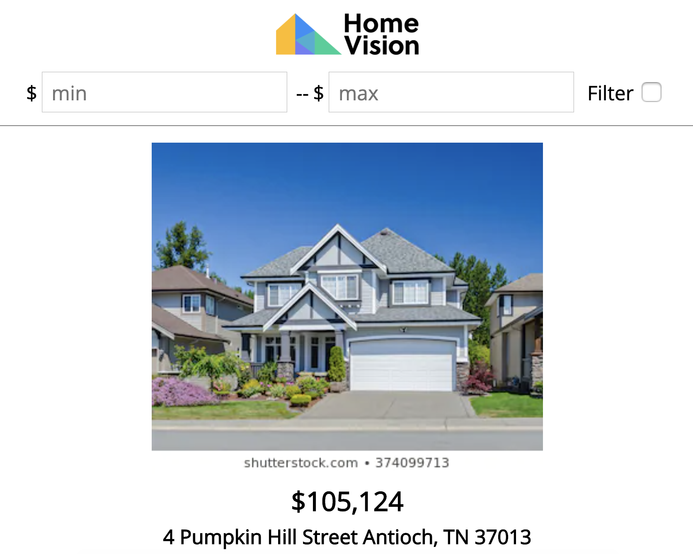

## Features
- Infinite scrolling.
- Filter houses by price.

  <kbd>
    
  </kbd>

## Installation & Set Up
Clone down this repository:

`$ git clone https://github.com/jaykmark/homevision.git`

You will need `node` and `npm` installed globally on your machine.  

Installation:

`$ npm install`  

To Start Server:

`$ npm start`  

To Visit App:

`localhost:3000`
